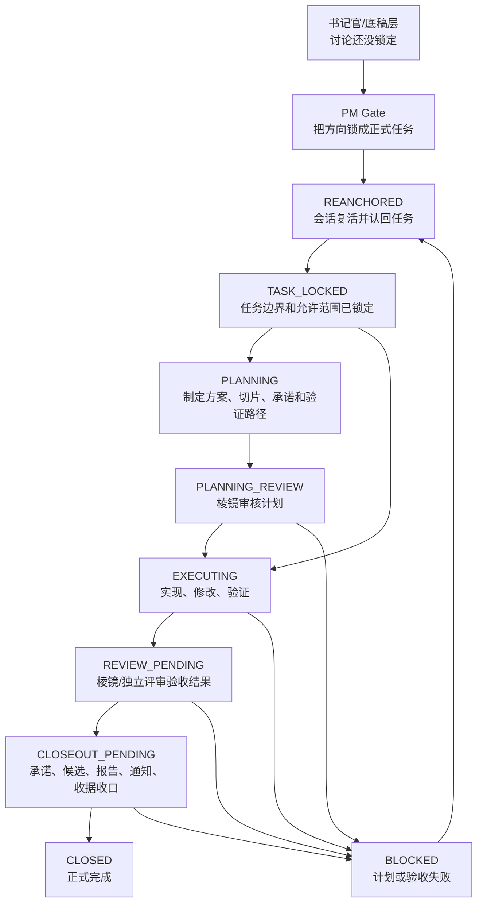
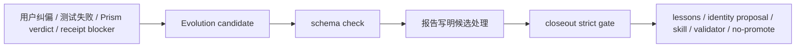

# RedCap 工作流全景图

> 面向 Norven 的人话版。它解释 RedCap 现在如何把“讨论、立项、计划、执行、评审、收尾、考古”串成一个 Agent 工程框架。

## 1. 先用一句话看懂

RedCap 不是一个“让 Agent 更努力”的提示词集合，而是一套把 Agent 工作外置成账本、状态、验收和收据的工程系统。

## 2. Layer A 和 Layer B 的区别

| 层 | 人话类比 | 适合场景 | 状态机形态 |
|---|---|---|---|
| Layer A | 一次项目流水线 | 构建一个用户项目，从需求到交付 | 单中心 FSM，主要由 `.workflow/state.yaml` 驱动 |
| Layer B | 持续作战指挥室 | RedCap 自身持续治理、修补、重构、考古 | 分布式 FSM，由任务卡、检查器、棱镜、receipt 等共同约束 |

Layer A 更像“做完一个项目”。Layer B 更像“维护一个会持续进化的 Agent 框架”。因此 Layer B 更复杂，也更接近 Norven 和 Cap 日常共事时真正需要的 Agent 工作模式。

## 3. Layer B 的状态主链

## 4. 书记官和任务账本的关系

| 名称 | 作用 | 是否 FSM 主链 |
|---|---|---|
| 书记官/底稿层 | 记录 PM Gate 前的讨论、分歧、选项和演进 | 不是主链，是上游喂料层 |
| canonical task ledger | 当前正式任务的法定账本，目前主要是 `.dev-task.md` | 是主链的任务真相源 |

书记官解决“讨论不要蒸发”。任务账本解决“正式任务到底是什么”。PM Gate 的作用，就是把底稿里已经对齐的内容翻译成任务账本。

## 5. 为什么要有 PLANNING 和 PLANNING_REVIEW

过去 plan 更像一个工件，容易出现“计划本身错了，但执行阶段才发现”的问题。复杂任务里，计划应当成为独立状态：

- `PLANNING`：Cap 制定方案、拆分切片、列承诺账本、定义验证路径。
- `PLANNING_REVIEW`：棱镜审核计划是否完整、必要、没有遗漏关键 gate。

这让 Norven 只负责战略方向，不再被迫审核每个执行细节。

## 6. 三表对账是什么

三表对账就是让三个视角互相校验：

| 视角 | 命令 | 看什么 |
|---|---|---|
| 收尾总控 | `./closeout-cap.sh status` | closeout runtime 自己认为任务是否完成 |
| 当前状态板 | `redcap-current-status.sh` | Norven 接盘时看到的全局状态 |
| 总体验血单 | `redcap-diagnose.sh` | 各检查器、证据、收尾链是否一致 |

如果三者说法打架，就说明 RedCap 自己内部出现了状态漂移。2026-04-24 抓到的 `sync-promises` 状态回退 bug，就是通过这个办法发现的。

## 7. 常见术语人话词典

| 术语 | 人话解释 |
|---|---|
| lifecycle | 一个任务从开始、计划、执行、评审到收尾的生命周期 |
| closeout | 正式收尾，不是“我说完了”，而是执行收尾程序 |
| receipt | 完工收据，证明任务真的闭环 |
| pending closure | 当前还没清掉的红线或 blocker |
| closure-ledger | 历史收尾日志，记录曾经怎么卡住、怎么清掉 |
| Prism acceptance | 棱镜验收，作者不能自证完成 |
| Evolution candidate | 进化候选，把经验、人格成长、skill、治理改良先记录成待处理事项 |
| Evolution harvest | 治理类任务报告里的候选处理说明，防止“候选根本没被写进池” |
| canonical task ledger | 当前任务的法定账本，主要是 `.dev-task.md` |
| runtime state | 机器运行时写出的状态，不靠聊天记忆保存 |

## 8. Evolution Factory 如何进入工作流

Evolution Factory 是 RedCap 的自我进化工厂。它不直接改 active identity，也不把所有经验一股脑写进 lessons，而是先放进候选池，再决定晋升或关闭。

关键原则：

| 原则 | 人话解释 |
|---|---|
| 先候选，再晋升 | 先把有价值信号收集起来，再决定它该去 lessons、identity proposal、skill 还是关闭 |
| active identity 不自动改 | 人格成长可以自动发现，但不能后台直接改 `~/.cap/identity.md` |
| closeout 前必须清账 | 候选还处于 `candidate / reviewing` 时，不允许生成 receipt |
| 报告必须交代候选处理 | 治理类任务如果报告不写候选处理，说明沉淀链可能漏了 |

## 9. skill 单一信源如何避免多宿主分叉

RedCap 现在把能力分成三层：

| 层 | 人话解释 |
|---|---|
| RedCap-native capability | RedCap 自己的真实能力，拥有任务卡、runtime、检查器和 closeout |
| host-exported skill | 宿主入口的轻量索引，只负责导入核心锚点和运行复活 |
| portable skill package | 未来可分发包，必须从 RedCap-native 源生成或链接 |

这解决的是“Claude、Codex、Gemini、Copilot 各写一份规则，最后全都漂移”的问题。宿主入口可以不同，但权威规则不能分叉。

## 10. 老旧资产治理如何进入工作流

“老旧资产治理”本身会作为新的 Layer B 任务进入 FSM。治理对象包括旧报告、旧镜像、旧模板、旧说明和旧状态面。处理方式分四类：

| 处理方式 | 适用对象 |
|---|---|
| 保留 | 历史证据、receipt、pending closure、closure-ledger、Prism 证据 |
| 翻译 | 入口文档、模板、状态面、`.dev-task.md` 这类仍承担当前工作流角色的资产 |
| 降级/归档 | 只剩历史价值、容易误导成 authority 的旧摘要或镜像 |
| 删除 | 已有新权威面替代且不会破坏考古能力的冗余文件 |

原则是边运行边迁移：先标注权威关系，再迁移高风险资产，最后才考虑删除。

## 11. 这套系统现在仍未解决什么

最大边界仍是 `GD-008`：Codex.app 这类宿主还没有公开的 repo-owned `pre-reply` / `final-reply veto`。RedCap 可以把“完成判定”从口头回复中拿走，但还不能在回复生成前 100% 拦住不该说的话。
